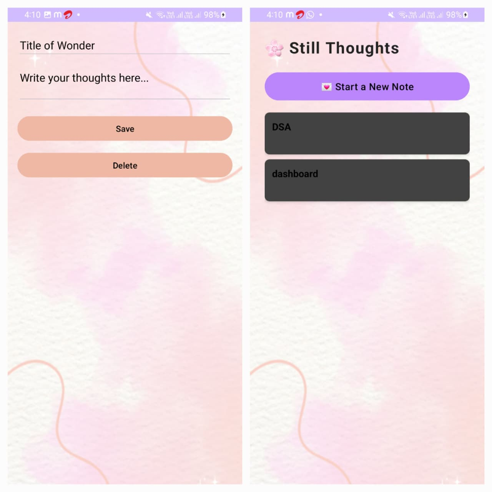

# DearDiary_notebook_Application

# 💌 Dear Diary –  A Soft Place for Daily Reflections

 <!-- Optional banner -->
Dear Diary is your beautifully crafted digital space for capturing thoughts, emotions, dreams, and everyday moments. Designed with elegance and simplicity in mind, this minimalist journaling app lets you document your inner world without distractions. Whether it’s your daily reflections, personal goals, random ideas, or heartfelt notes — Dear Diary keeps it safe, organized, and private.
---




## ✨ Features

- 🖋️ **Create, Edit & Delete Notes**  
- 📋 **Compact Card Design for Better Overview**  
- 🎨 **Aesthetic Typography & Clean Layout**  
- 🧠 **Offline Support with SQLite**  
- 📱 **User-Friendly & Responsive UI**  
- 💜 **Soft Visuals**

---


## 🔧 Tech Stack

- **Java** – Core development language  
- **Android Studio** – IDE  
- **SQLite** – Local note storage  
- **RecyclerView** – For displaying notes  
- **XML** – Custom UI layouts  

---

### Prerequisites
- Android Studio Installed
- Android SDK setup
- Minimum SDK version: `21`

### Installation

```bash
git clone https://github.com/ASHVINIKODE/DearDiary_notebook_Application.git
cd DearDiary_notebook_Application

